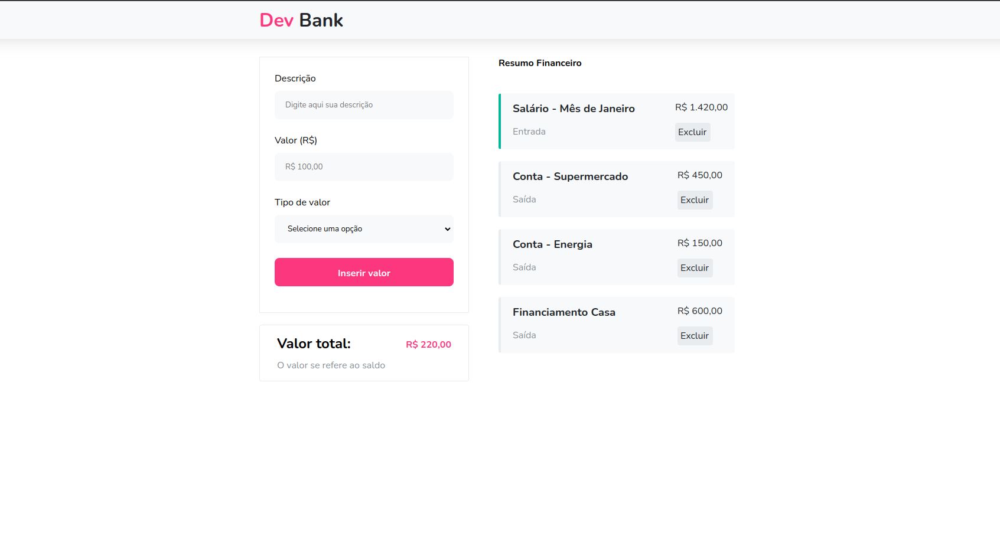

# Dev Bank

## Sobre o Projeto

Dev Bank é uma aplicação desenvolvida em React para gerenciar gastos, entradas e saídas de dinheiro. A aplicação permite que os usuários acompanhem suas transações financeiras de maneira eficiente e intuitiva.

## Tecnologias Utilizadas

- React
- Vite
- Sass

## Como Executar o Projeto

1. Baixe o repositório
`git clone https://github.com/matheusprado1/dev-bank`

2. Entre no diretório onde o repositório foi baixado
`cd caminho/para/o/diretorio`

3. Instale as dependências
`npm install`

4. Inicie o servidor de desenvolvimento
`npm run dev`

5. Abra http://localhost:5174 no seu navegador para ver a aplicação.

## Funcionalidades

- Adicionar transações (entradas e saídas)
- Visualizar lista de transações
- Excluir transações
- Visualizar o total de entradas, saídas e saldo

## Contribuições

Contribuições são sempre bem-vindas. Sinta-se à vontade para abrir uma issue ou fazer um pull request.